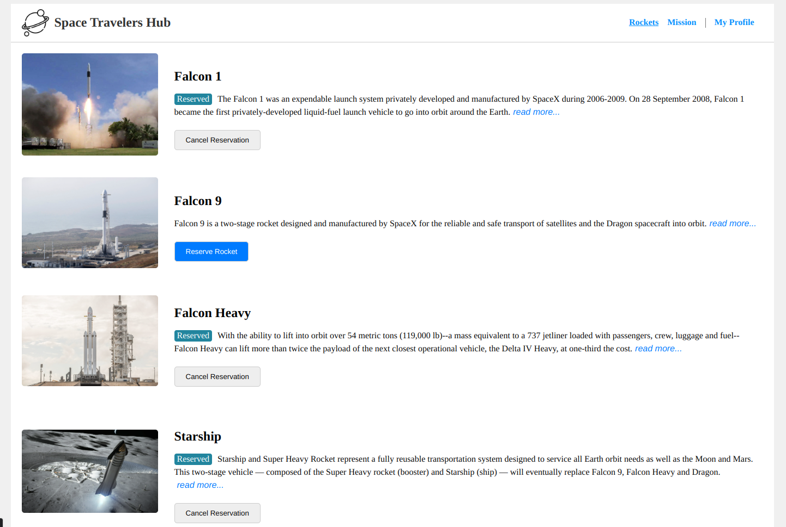

<div align="center">

  
  <br/>

  <h3><b>space_flight</b></h3>

</div>

# 📗 Table of Contents

- [📗 Table of Contents](#-table-of-contents)
- [📖 Fullstack Development ](#-fullstack-development-)
    - ["Space Travellers' Hub" is a web application that books virtual rocket and join missions.](#space-travellers-hub-is-a-web-application-that-books-virtual-rocket-and-join-missions)
  - [🛠  Built With ](#--built-with-)
    - [Key Features ](#key-features-)
  - [💻 Getting Started ](#-getting-started-)
    - [Prerequisites](#prerequisites)
    - [Setup](#setup)
    - [Usage](#usage)
  - [👥 Authors ](#-authors-)
  - [🔭 Future Features ](#-future-features-)
  - [🤝 Contributing ](#-contributing-)
  - [⭐️ Show your support ](#️-show-your-support-)
  - [🙏 Acknowledgments ](#-acknowledgments-)
  - [❓ FAQ ](#-faq-)
  - [📝 License ](#-license-)


# 📖 Fullstack Development <a name="Space Flight"></a>

### "Space Travellers' Hub" is a web application that books virtual rocket and join missions.

## 🛠  Built With <a name="built-with"></a>
- HTML
- SCSS
- JavaScript
- React
- Redux
### Key Features <a name="key-features"></a>

<p align="right">(<a href="#readme-top">back to top</a>)</p>

## 💻 Getting Started <a name="getting-started"></a>

### Prerequisites

In order to run this project you need:

### Setup

Clone this repository to your desired folder:
```sh
  git clone https://github.com/udek/space_flight $HOME
```
### Usage

To run the project, execute the following command:

```sh
  cd $HOME/space_flight
  npm install
  npm run build
  npm run start
```

<p align="right">(<a href="#readme-top">back to top</a>)</p>


## 👥 Authors <a name="authors"></a>
👤 **Martins Udek**
- GitHub: [@udek](https://github.com/udek)
- Twitter: [@udek](https://twitter.com/udek)
- LinkedIn: [LinkedIn](https://linkedin.com/in/udek)

<p align="right">(<a href="#readme-top">back to top</a>)</p>


## 🔭 Future Features <a name="future-features"></a>


<p align="right">(<a href="#readme-top">back to top</a>)</p>

## 🤝 Contributing <a name="contributing"></a>

Contributions, issues, and feature requests are welcome!

Feel free to check the [issues page](https://github.com/udek/space_flight/issues).

<p align="right">(<a href="#readme-top">back to top</a>)</p>


## ⭐️ Show your support <a name="support"></a>

<p align="right">(<a href="#readme-top">back to top</a>)</p>


## 🙏 Acknowledgments <a name="acknowledgements"></a>
- ALX

<p align="right">(<a href="#readme-top">back to top</a>)</p>

## ❓ FAQ <a name="faq"></a>

- **Can I run this project run on Docker?**

  - yes

<p align="right">(<a href="#readme-top">back to top</a>)</p>

## 📝 License <a name="license"></a>

This project is [MIT](./LICENSE) licensed.

<p align="right">(<a href="#readme-top">back to top</a>)</p>

